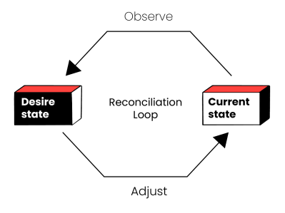

# Codebase Manager 

**CodeBase Manager** est un outil en ligne de commande pour gérer un projet Moodle avec Git.

L'outil est un script bash qui fonctionne dans un environnement Linux.

Vous décrivez la configuration souhaitée dans un fichier au format yaml:

```
  project:
    name: demo
    branch: demo

  moodle:
    version: 4.5+

  plugins:
    moodle-filter_filtercodes:      

    moodle-mod_attendance:

```    
## Principe de fonctionnement 

Le fichier de configuration définit l'état demandé de la base de code.
Les informations concernant le dépôt des sources, la version des plugins sont récupérées depuis le
[répertoire officiel des plugins](https://moodle.org/plugins).
L'outil sélectionne une version du plugin compatible avec la version de Moodle.

### Fonctionnement 

Un fichier unique de configuration définit l'***état demandé***

 

Le script observe l'***état courant*** et si il est différent de l'***état demandé***, il y a génèration d'une nouvelle base de code. 

### Git 

Le fait de tout gérer sous git présente plusieurs avantages :

- automatisation des tâches : installation des plugins, des montées de version mineures de Moodle 
- conservation d'un historique des mises à jour:
  - documentation automatique de ce qui est installé
  - possibilité de restoration d'un état antérieur

Nota: pour faire simple, on n'utilise pas les fonctions git submodules. 

## Pour démarrer

Les informations nécessaires pour démarrer se trouvent [ici](docs/tutorials/Getting-started.md) 

La documentation se trouve dans le répertoire **docs** :

- tutorials : pour démarrer
- how-to-guides: comment faire 
- reference : document de référence sur les commandes
- discussions: documents sur des sujets relatifs au projet

Le fichier de configuation du projet : projects/<nom du projet>/<nom du projet>.yml
Les sources de la base de code générée :
cd cbm/moodle
git checkout <nom du projet>

## tips jq


$ jq -r '[.versions[]| {(.vcstag): (.supportedmoodles[].release)}]' tmp.json

[
  {
    "v1": "3.9"
  },
  {
    "v1": "3.10"
  },
  {
    "v1": "3.11"
  },
  {
    "v2": "4.4"
  },
  {
    "v2": "4.5"
  }
]


$ jq -r '[.versions[]| {(.vcstag): (.supportedmoodles[].release)}]|length' tmp.json

5

List all version supported

jq -r '.versions[]| {(.vcstag): (.supportedmoodles[].release)}|.[]' tmp.json

List vcstag for sopported Moodle version

jq -r '[.versions[]| {version: .vcstag, moodle: .supportedmoodles[].release}]|.[]|select(.moodle == "4.5")' tmp.json

## Structure du fichier <project>.json

jq . demo.json
{
  "project": {
    "name": "demo",
    "branch": "demo"
  },
  "moodle": {
    "version": 5.1
  },
  "plugins": []
}

Pour ajouter un element au tableau des plugins

jq  '.plugins[.plugins| length] |= . + { "name": "tool_excimer"}' demo.json > demo.tmp && mv demo.tmp demo.json

Pour lister les plugins

jq -r '.plugins[].name' demo.json

### build plugins array
plugins=($(jq -r ".plugins[].name" projects/demo/demo.json | tr "\n" " "))

echo nb:"${#plugins[@]}"
i=0
IFS=" "
for plugin in ${plugins[*]}
do
    echo "$i" "${plugin}"
    ((++i))
done

Pour filter sur un plugin 
jq -r '.plugins[].name' projects/demo/demo.json | grep "tool_redis" 
jq -r '.plugins[] | select(.name == "tool_redis")' projects/demo/demo.json

Pour retire un plugin du projet
jq '.| del(.plugins[] | select(.name == "tool_redis"))' projects/demo/demo.json

