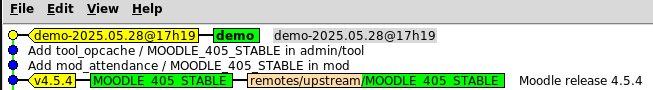

# Création d'un nouveau projet

Le tutoriel enchaine les différentes étapes de la génération d'une nouvelle base de code :
A l'issue vous obtiendrez :
- une base de code Moodle:
  - Version Moodle 4.5 avec les derniers fixes publiés
  - installation de 2 plugins : mod_attendance, tool_opcache

## Pre requis

L'outil est un script bash qui fonctionne dans un environnement Linux avec les pre requis suivants:

- installation de git 

```bash

  sudo apt install git

```
Configurer username and email en utilsant les commandes ci dessous, après avoir mis à jour les informations :

```bash
  git config --global user.name "Emma Paris"
  git config --global user.email "eparis@gmail.com"

```
Optionnel: installation de l'ouil de visualisation d'un depot git **gitk**


- installation du package jq pour lire les fichiers au format json

```bash

  sudo apt install jq

```

- installation de [yq](https://github.com/mikefarah/yq/#install) pour lire le fichier de configuration au format yaml
  sous ubuntu/debian pour installer la dernière version
  
  ```bash

    sudo wget https://github.com/mikefarah/yq/releases/latest/download/yq_linux_amd64 -O /usr/bin/yq
    sudo chmod +x /usr/bin/yq

  ```

## Installation

cloner le dépôt du script Code Base Manager (cbm) dans votre environnement de travail :

```bash

  git clone https://gitbub.com:cbillon/cbm.git
  
```
- le fichier env.cnf permet de décrire l'environnement de l'outil Code Base Manager
Par défaut un fichier env.cnf sera créé à partir de env.cnf.default
Si vous souhaitez un environnement personnalisé, mettez à jour le fichier de configuration avant de le sauvegarder.

## Les étapes 

Lancer l'exécution du script pour exécuter les différentes étapes :

- 1 création d'un nouveau projet  
- 2 Installation des plugins
- 3 Mise à jour de la base de code
- 4 Génération d'une nouvelle livraison
- 5 Mise à jour Moodle
- 6 Mise des plugins

### 1 Création du nouveau projet

Lancer le script à partir du répertoire d'installation:

```
  cd cbm
  ./cbm

```
Les options d'installation sont présentées :

Faites Entrée
Les options sont conservées dans un fichier env.cnf

Saisir ensuite le nom du projet, par exemple : demo
Indiquer la version de Moodle: 4.5+

A chaque projet est associée une base de code.

Le fichier de configuration de la base de code s'affiche :

Il comporte :
- le nom du projet
- la version source de Moodle 
- la liste des plugins à installer (cette liste est vide au démarrage)

L'outil maintient en local un dépôt Moodle, ainsi qu'un dépôt pour chacun des plugins à installer.
Il est possible de gérer plusieurs projets (multi instances), les éléments communs étant partagés (dépôt Moodle, plugins).

#### Version de Moodle

La version Moodle est précisée lors de la création du projet.
L'option définie ici est 4.5+
cela désigne la dernière version 4.5 de Moodle disponible avec les dernières mises à jour hebdomadaires.

Il est possible de définir une version figée : 4.5.1 par exemple.
Les différentes options du fichier de configuration sont détaillées [ici](../reference/conf.md)

### 2 Installation des plugins

2 étapes :
- import pour mettre à jour le dépôt local des plugins (mise à jour du cache)
- ajouter le plugin au projet

#### 2.1 Mise à jour du cache des plugins

Choisissez dans le menu **Import d'un plugin**

A partir du nom saisi par l'administrateur l'outil va chercher les informations dans le répertoire officiel des plugins agréés par Moodle.
Vous pouvez saisir le nom du plugin sous la forme normalisée <type>_<nom>

Le script récupère le source du dépot du plugin à partir du [dépot officiel](https://moodle.org/plugins).

Le dépôt du plugin est cloné en local.
Les plugins importés dans le cache en local.
Le cache Moodle des plugins est partagé par toutes les instances de base de code (factorisation des sources)

nota : il est possible 
- de choisir un plugin qui n'est pas dans le répertoire officiel Moodle en saisissant directement l'url du dépôt du plugin dans le fichier de configuration.
- d'utiliser une version personnalisée du plugin.

#### 2.2 Mise à jour du fichier de configuration

En lançant la commande : **Ajout d'un plugin au projet**

Le script présente la liste des plugins présents dans le cache, mais ne faisant pas partie du projet.
L'administrateur sélectionne le (ou les) plugin(s) à installer.

#### Détermination de la version de plugin à installer

La version à installer dépend de la version Moodle du projet.   
Le script propose une version (best effort..), et laisse à l'administrateur la possibilité de corriger cette proposition.
dans le fichier de configuration version précise la version du plugin à utiliser.

La version peut être :
- une branche 
- une étiquette (tag)
- un commit   

C'est cette information qui donne l'état de la ressource, qui sera utilisée dans la boucle de reconciliation (état observé versus état attendu).

Pour agréer un plugin, Moodle demande au développeur d'indiquer un dépôt git (la plupart du temps github)

Mais celui ci n'a pas à préciser ***comment sont gérées les dépendances du plugin avec les versions de Moodle***. 

Ce qui fait que plusieurs pratiques co existent :
- une branche unique 
- une branche pour chaque version majeure de Moodle
Le script essaie de déterminer la version du plugin compatible avec la version Moodle, mais laisse la possibilité à l'administrateur de modifier cette proposition.

### 3 Mise à jour de la base de code

nota: quand il y a eu ajout ou suppression d'un plugin dans le fichier de configuration, l'opération de mise à jour de la base de code est effectuée automatiquement.

A l'issue de cette étape les plugins figurant dans le fichier de configuration sont installés.
Vous pouvez le vérifier en examinant le dépôt Moodle du projet.
depuis le répertoire d'installation.


### 4 Génération d'une livraison

Pour la dernière étape, lancer l'option du menu **Génération d'une nouvelle livraison du projet**
La base de code se trouve dans le depot Moodle sous la branche demo (nom du projet
Chaque livraison crée un nouveau commit avec une étiquette (tag) 

```
  cd cbm/moodle
  git switch <nom du projet>
  gitk 

```
)
vous pouvez voir l'historique des mises à jour du projet 

- le tag identifiant la livraison (nom du projet+timestamp de génération)
- les commits correspondants à l'installation des plugins
- la branche de Moodle de départ du projet

### 5 Mise à jour de Moodle

Moodle publie régulièrement des mises à jour:
- des fixes hebdomadaires
- une nouvelle version mineure tous les 2 mois

La publication d'une nouvelle version mineure est précédée du passage d'une série de tests.

Ces mises à jour peuvent entrainer une mise à jour de la base de code.

Dans le menu, la commande **Mise à jour Moodle** effectue cette opération de mise à jour.

dans le détail :
- recherche des dernières mises à jour Moodle
- si cela entraine une mise à jour de la base de code, mise à jour du dépôt Moodle local, fusion avec la branche du projet 

Après cette opération vous obtenez une nouvelle version compléte de la base de code.
